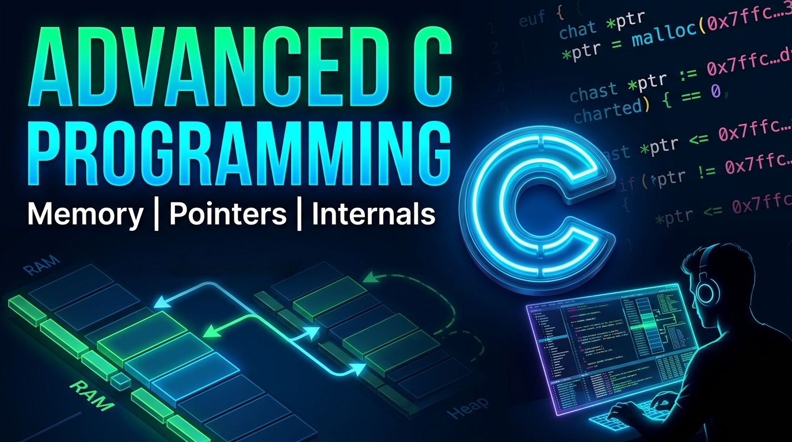

# Advanced C Programming Notes

## 📌 Overview

This repository contains structured **Markdown documentation** covering advanced concepts in the C programming language.

It is designed as a clean and well-organized knowledge base for understanding deeper topics in C, along with important technical insights and programming quotations.

## 🎯 Purpose

The goal of this repository is to:

- Provide clear explanations of advanced C programming concepts
- Serve as structured learning notes
- Share practical low-level programming knowledge
- Preserve important programming insights and quotations

